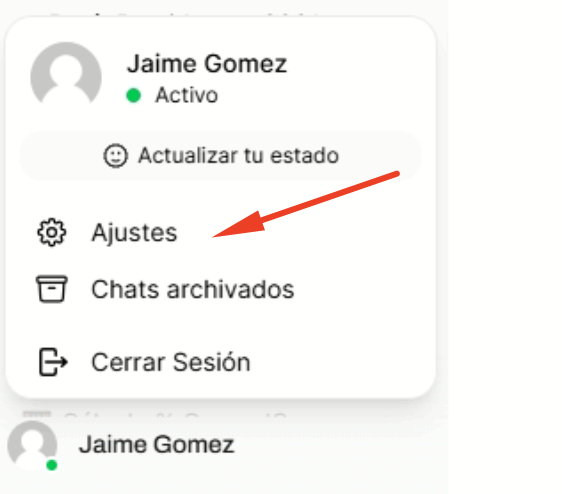
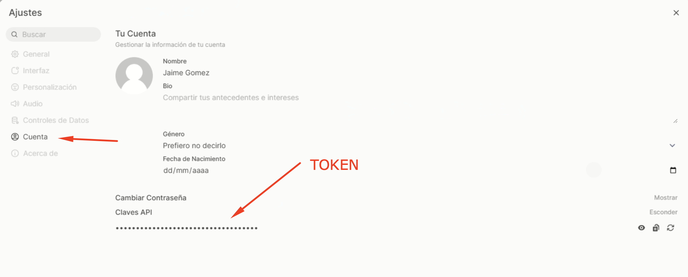

# Proyecto TD - GPT

## 1. Obtener el TOKEN

- Ingresar al aplicativo

```
http://192.168.17.11:3000
```

- Ir a ajustes

    

- Generar el TOKEN

    


## 2. Probar desde consola

```
curl -X POST "http://192.168.17.11:3000/api/chat/completions" \
     -H "Authorization: Bearer COPIAR_TOKEN" \
     -H "Content-Type: application/json" \
     -d '{
       "model": "mistralai/Ministral-3-14B-Reasoning-2512",
       "messages": [
         {
           "role": "user",
           "content": "Dame un programa en Python que imprima Hola, mundo!"
         }
       ]
     }'

```

## 3. Probar con Python

- Instalar el Virtual Enviroment, ver documento <a href=INSTALL.md>INSTALL.md</a>

- Estructura de archivos
```
--\ src
|    |
|    |-- list_models_ia.py       # Listar modelos de IA disponibles
|    |-- test_model_api_rest.py  # Invocar a un model o de IA para consulta
|    
|-- .env

```

- Archivo .env
```
OPENWEBUI_URL="http://192.168.17.11:3000"
USER_API_KEY="COPIAR_TOKEN"
```
