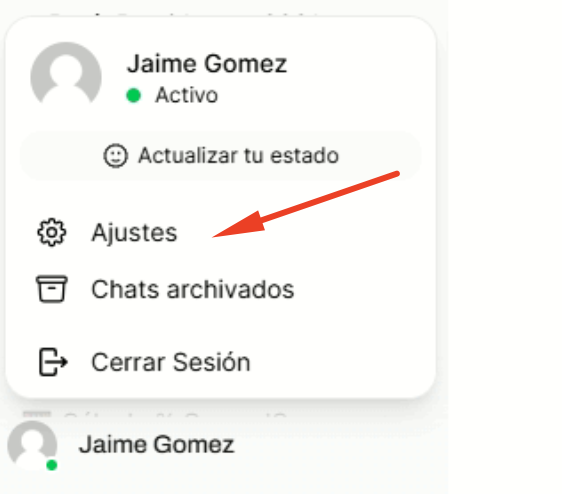
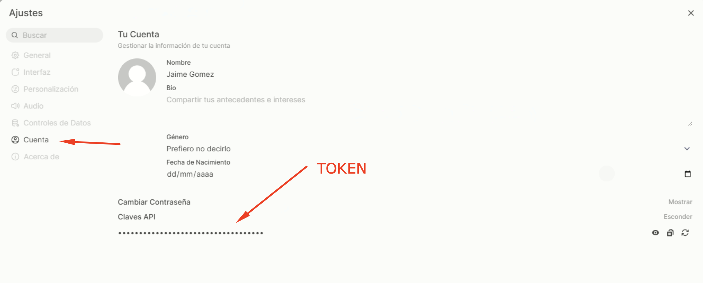

# Proyecto TD - GPT

## 1. Obtener el TOKEN

- Ingresar al enlace dentro de la red cableada de los laboratorios de TD : [http://192.168.17.11:3000](http://192.168.17.11:3000)

- Ir a ajustes

    

- Generar el TOKEN

    


## 2. Probar desde consola

- Ejecutar el siguiente comando desde consola, recomendable usar el Git Bash en Windows

- Respuesta sin Stream
```
curl -X POST "http://192.168.17.11:3000/api/chat/completions" \
     -H "Authorization: Bearer COPIAR_TOKEN" \
     -H "Content-Type: application/json" \
     -d '{
       "model": "google/gemma-4-26B-A4B-it",
       "messages": [
         {
           "role": "user",
           "content": "Dame un programa en Python que imprima Hola, mundo!"
         }
       ],
      "stream": false
     }'

```

- Respuesta por Stream
```
curl -X POST "http://192.168.17.11:3000/api/chat/completions" \
     -H "Authorization: Bearer COPIAR_TOKEN" \
     -H "Content-Type: application/json" \
     -d '{
       "model": "google/gemma-4-26B-A4B-it",
       "messages": [
         {
           "role": "user",
           "content": "Dame un programa en Python que imprima Hola, mundo!"
         }
       ],
      "stream": true
     }'

```

- Respuesta por Stream. Visualizando línea por línea
```
curl -s -X POST "http://192.168.17.11:3000/api/chat/completions" \
     -H "Authorization: Bearer COPIAR_TOKEN" \
     -H "Content-Type: application/json" \
     -d '{
       "model": "google/gemma-4-26B-A4B-it",
       "messages": [
         {
           "role": "user",
           "content": "Dame un programa en Python que imprima Hola, mundo!"
         }
       ],
      "stream": true
     }'     \
  | grep --line-buffered '^data: ' \
  | sed -u 's/^data: //' \
  | grep --line-buffered -v '^\[DONE\]$' \
  | jq -j --unbuffered '.choices[0].delta.content // empty'

```


## 3. Probar con Postman

- Método HTTP

```text
POST
```


- URL

```text
http://192.168.17.11:3000/api/chat/completions
```


- Headers


| Key           | Value               |
| ------------- | ------------------- |
| Authorization | Bearer COPIAR_TOKEN |
| Content-Type  | application/json    |


- Configuración del Body

Ir a:

```text
Body → raw → JSON
```

Luego pegar:

```json
{
  "model": "google/gemma-4-26B-A4B-it",
  "messages": [
    {
      "role": "user",
      "content": "Dame un programa en Python que imprima Hola, mundo!"
    }
  ]
}
```


- Enviar solicitud

Presionar:

```text
Send
```


- Respuesta esperada (PENDIENTE)

```json

```

## 3. Probar con Python

- Instalar el Virtual Environment, ver documento [INSTALL.md](INSTALL.md)
- Estructura de archivos

```
--\ src
|    |
|    |-- list_models_ia.py       # Listar modelos de IA disponibles
|    |-- test_model_api_rest.py  # Invocar a un modelo de IA para consulta
|    
|-- .env

```

- Archivo .env

```
# URL de la API de OpenWebUI
OPENWEBUI_URL="http://192.168.17.11:3000"
# API Key de la API de OpenWebUI
USER_API_KEY="YOUR_API_KEY"
# Modelo de IA a usar en la API de OpenWebUI
MODEL="google/gemma-4-26B-A4B-it"
```